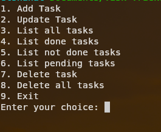
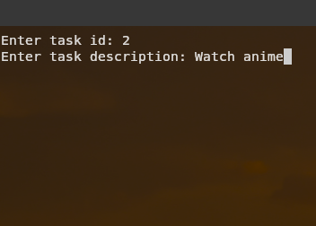
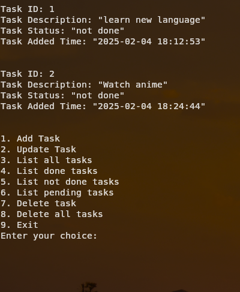

# Task Tracker App in c++
[](https://isocpp.org/)

A simple task tracker application implemented in C++ using object-oriented programming concepts. This project is perfect for learning C++ programming and exploring OOP principles.





## Table of Contents
- [Overview](#overview)
- [Features](#features)
- [Installation](#installation)
- [Usage](#usage)
- [Contributing](#contributing)

## Overview

Task Tracker is a simple application that allows users to manage their tasks. Users can add, remove, and view tasks using a command-line interface.

## Features

- **Task Management:** Add, remove,edit, and view tasks.
- **Command-Line Interface:** Interact with the application via the terminal.
- **Object-Oriented Design:** Utilizes classes and objects to model tasks.

## Installation

### Prerequisites
- A C++ compiler that supports C++11 or later.
- [CMake](https://cmake.org/) installed on your system.

### Build Instructions
1. **Clone the Repository**

   ```bash
   git clone https://github.com/AbdelrahmanElshahat/Task-Tracker.git
   cd Tic-Tac-Toe
2. **Build the Project**

   ```bash
   mkdir build
   cd build
   cmake ..
   cmake --build .

## Usage
After building the project, you can run the application from the terminal. The application supports the following commands:

1. **Add Task:** Add a new task to the task list.
2. **Remove Task:** Remove a task from the task list.
3. **Edit Task:** Edit an existing task in the task list.
4. **View Tasks:** View all tasks in the task list.
5. **Exit:** Exit the application.

## Contributing
Contributions are welcome! To contribute:
1. Fork the repository.

2. .Create a new branch.
    ```bash
    git checkout -b feature/your-feature-name.
3. Make your changes and commit them.
    ```bash
    git commit -m 'Add some feature'.
4. Push to your branch.
    ```bash
    git push origin feature/your-feature-name. 

